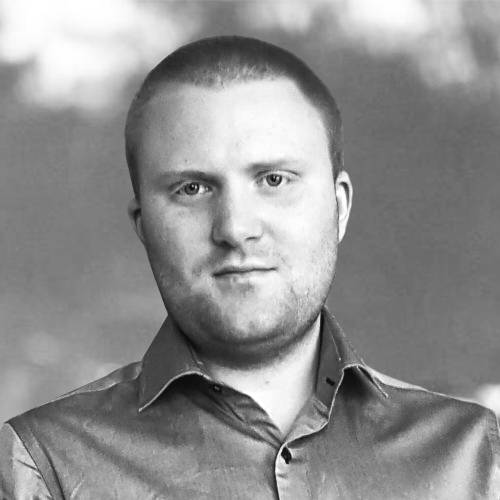

Enthusiastic Bioinformatics programmer with 3+ years of experience in Bioinformatics Research and Machine Learning (ML), with a demonstrated command of ML frameworks, Object Oriented programming, and data structures. Working experience with AWS Docker, EC2 instances scaling, and optimization. Focused on further developing acquired skills by learning from top teams and completing development projects. Seeking an opportunity that offers professional challenges utilizing interpersonal skills, excellent time management, and problem-solving skills.

